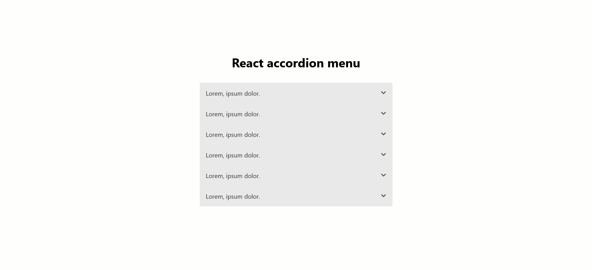
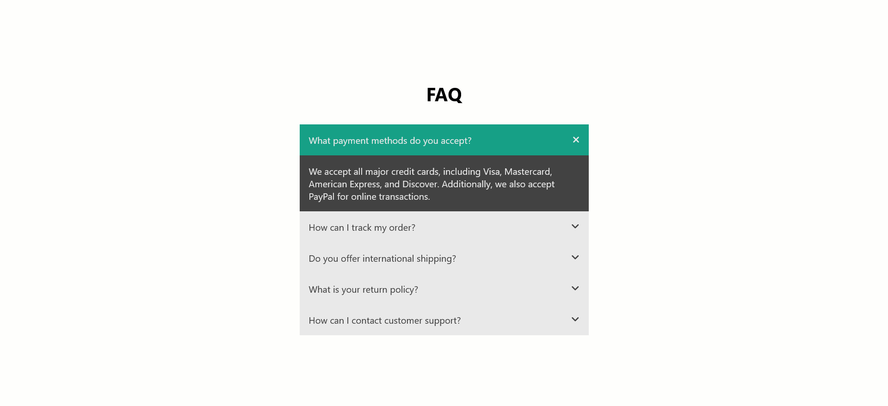

# React Accordion menu 🪗

A simple accordion menu made with react

Note: this is probably the last "simple" project i'll make for a long time. Stay tuned for more advanced projects in the future

## Table of contents 📑

- [Features ✨](#features-✨)
- [Installation & Usage 🛠️](#installation--usage-🛠️)
- [Screenshots 📷](#screenshots-📷)
- [Technologies Used 🔬](#technologies-used-🔬)
- [Roadmap 🗺️](#roadmap-🗺️)
- [License 📝](#license-📝)
- [Acknowledgments 🙏](#acknowledgments-🙏)
- [Project Status 🔥](#project-status-🔥)
- [Author 👤](#author-👤)
- [Contact 📧](#contact-📧)

## Features ✨

- Responsive accordion menu 
- Smooth open-close animation
- Customizable text(not yet implemented)

## Installation & Usage 🛠️

<!--React apps-->

### React apps

1. Clone the repository using `git clone https://github.com/BeanyTheCoder/repo-name.git`.

2. Navigate to the project directory using `cd repo-name`.
3. Install dependencies with `npm install`.
4. Run the app with `npm run dev`.

## Screenshots 📷

## Technologies Used 🔬

- React.js 
- SCSS

## License 📝

This project is licensed under the [License Name](link-to-license-file).

## Acknowledgments 🙏

- I got the color theme from [w3schools](https://www.w3schools.com/) dropdowns, so thanks to them 🙏.

- I used css `grid-template-rows` for smooth transitions between open and closed panels. I got that idea from Kevin Powell's [video](https://www.youtube.com/watch?v=B_n4YONte5A&t=3s) on that topic, so thanks to him for that 🙏.

## Project Status 🔥

`version 1.1`, deployed

## Author 👤

My name is Alexander Afoko Jnr. and I am a passionate 14-year-old frontend developer from Ghana.
I hope to build up my portfolio and take my skills to the next level.

## Contact 📧

- Gmail - alexanderafoko@gmail.com
- Github - [BeanyTheCoder](https://github.com/BeanyTheCoder)
- Frontend Mentor - [@BeanyTheCoder](https://www.frontendmentor.io/profile/BeanyTheCoder)
- Discord - beanythecoder